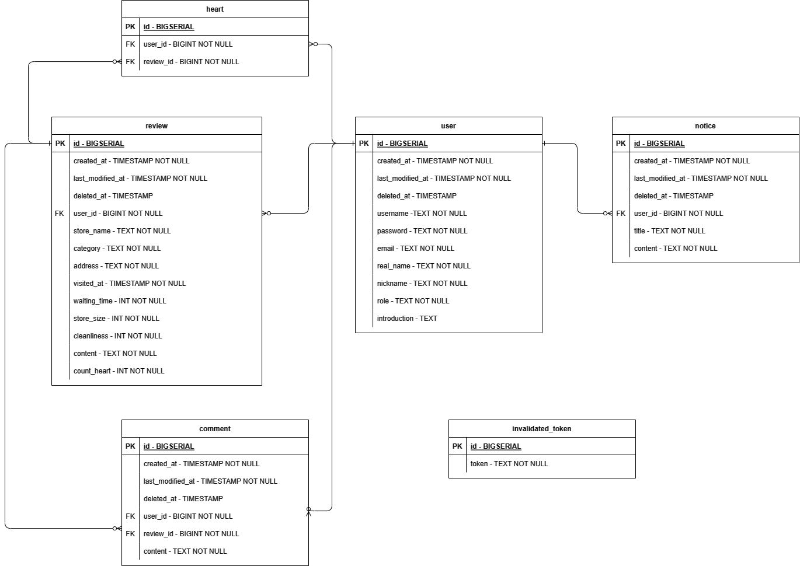
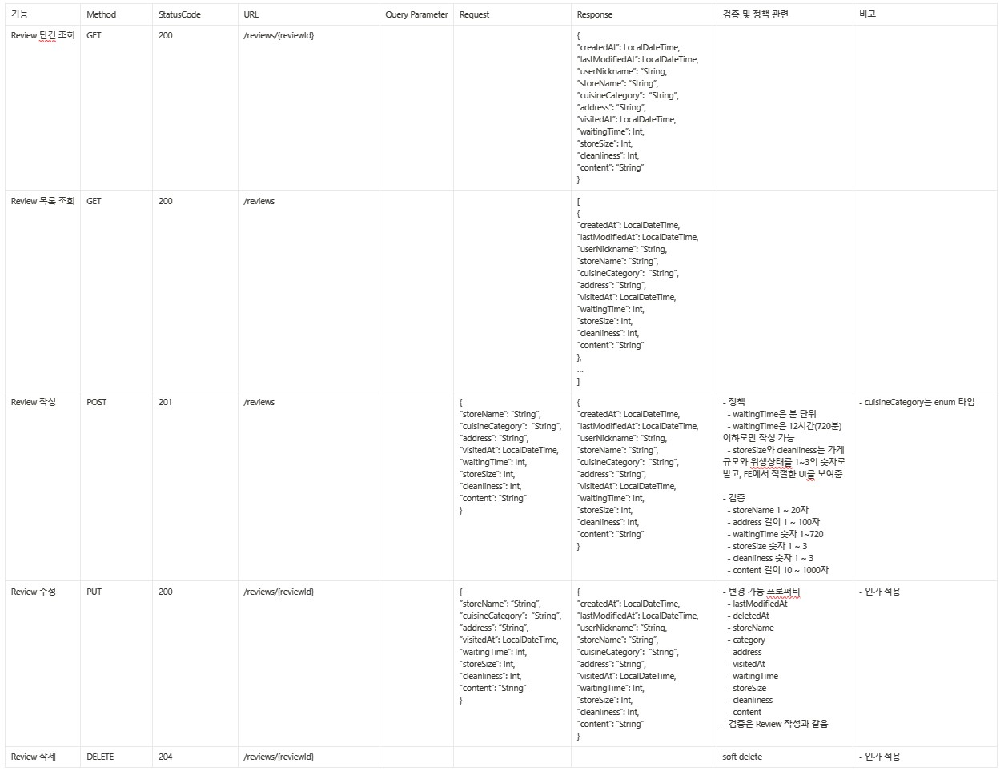
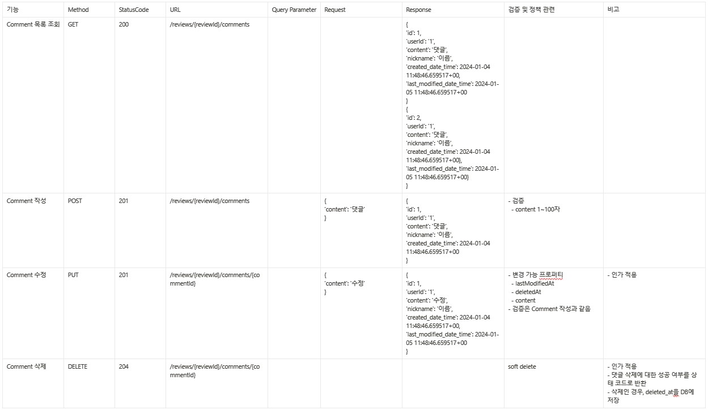
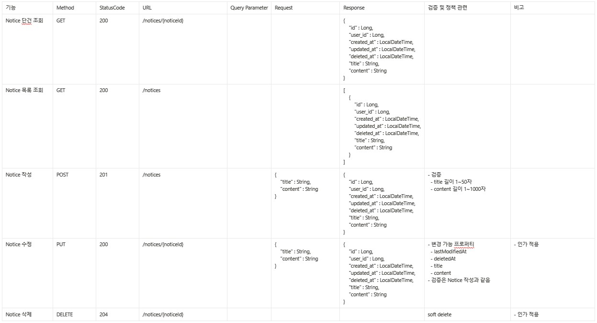
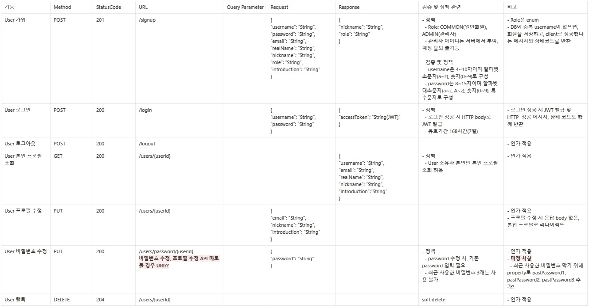
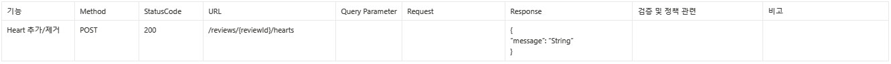

# b3backoffice
내일배움캠프 백오피스 프로젝트 B-3조

## 프로젝트 소개
### \- 프로젝트 주제: 로컬 맛집 리뷰
### \- 서비스 핵심
- 단순한 별점 맛집 리뷰가 아니다
- 식당의 웨이팅 시간, 가게 규모, 위생 상태까지 우리 지역의 찐 맛집 리뷰
### \- 팀원 역할 분배
- 곽준선: 팀 조율, Review CRUD 기능, refresh token
- 박지영: Notice CRUD 기능
- 김철학: 회원가입 기능, 로그인 로그아웃 기능, Heart(좋아요) 기능
- 노하영: Comment CRUD 기능, 프로필 수정 기능
### \- 프로젝트 진행 상황
- 진행 상황 확인: https://github.com/users/rugii913/projects/10

### \- 사용 기술
- Kotlin
- Spring
  - Spring Boot 3.2.2
  - Spring Web
  - Spring Data JPA
  - Spring Security
  - Spring bean validation
- DB
  - PostgreSQL / 로컬 H2
- Swagger(OpenAPI)

## 프로젝트 명세
### ERD

### API 명세
#### Review

#### Comment

#### Notice

#### User

#### Heart

