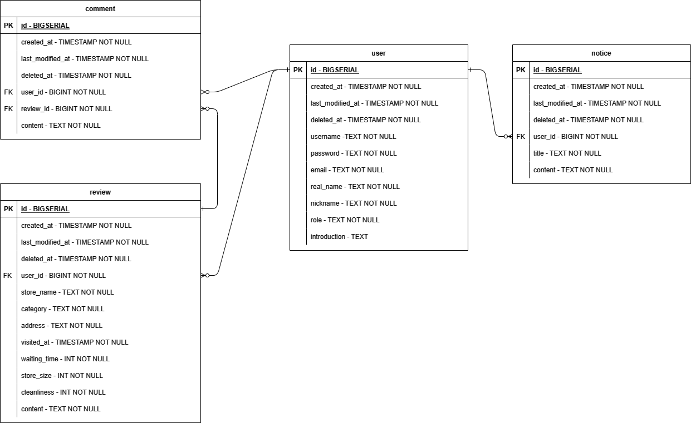
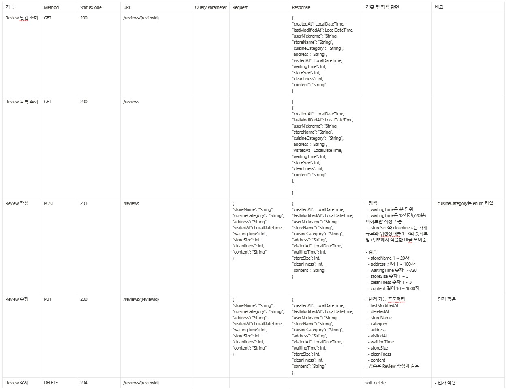
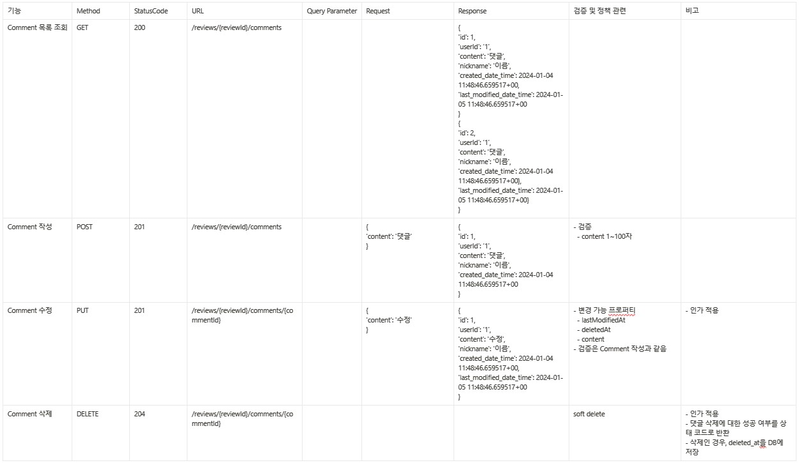
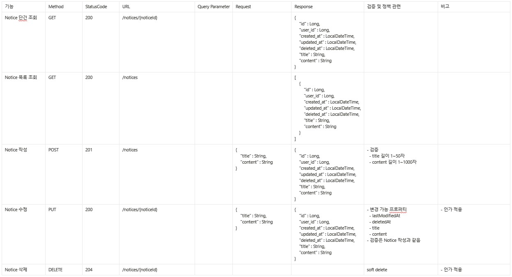
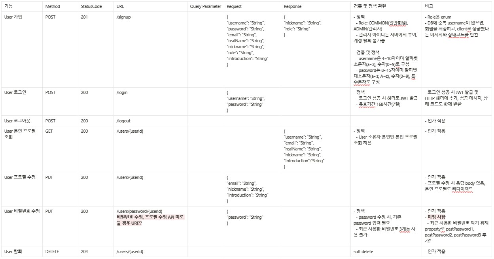

# b3backoffice
내일배움캠프 백오피스 프로젝트 B-3조 저장소

### 프로젝트 진행 상황
https://github.com/users/rugii913/projects/10

### 팀원
- 곽준선: 팀 조율, Review CRUD 기능
- 박지영: Notice CRUD 기능
- 김철학: 회원가입 기능, 로그인 로그아웃 기능
- 노하영: Comment CRUD 기능, 프로필 수정 기능

### 사용 기술
- Kotlin
- Spring
  - Spring Boot 3.2.2
  - Spring Web
  - Spring Data JPA
  - Spring Security
  - Spring bean validation
- DB
  - PostgreSQL / 로컬 H2
- Swagger(OpenAPI)

### ERD

### API 명세
#### Review

#### Comment

#### Notice

#### User

