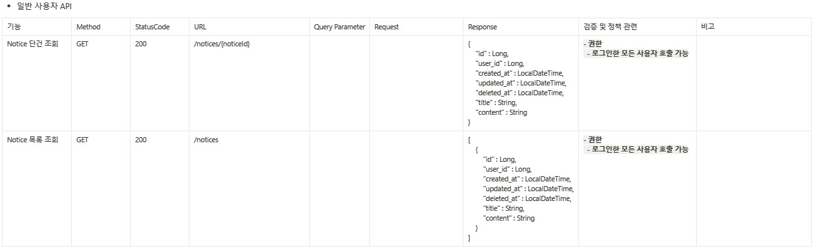

# b3backoffice
내일배움캠프 백오피스 프로젝트 B-3조

## 프로젝트 소개
### \- 프로젝트 주제: 로컬 맛집 리뷰
### \- 서비스 기획 의도
- 별점 맛집 평가 x, 가게의 자세한 정보 리뷰(웨이팅 시간, 가게 규모, 위생 상태 등)
- 전국구 서비스를 표방하기보다는 지역에 대한 애정, 진짜 로컬 맛집 리뷰
### \- 팀원 역할 분배
- 곽준선: 팀 조율, Review CRUD, 로그아웃 및 refresh token
- 박지영: (Notice) CRUD, 관리자 API, RBAC 기반 요청 처리
- 김철학: 회원가입, 로그인 로그아웃, (Review) 관리자 API, RBAC 기반 요청 처리
- 노하영: 회원 프로필 수정, (Comment) 관리자 API, RBAC 기반 요청 처리
### \- 프로젝트 진행 상황
- 진행 상황 확인: https://github.com/users/rugii913/projects/10

### \- 사용 기술
- Kotlin
- Spring
  - Spring Boot 3.2.2
  - Spring Web
  - Spring Data JPA
  - Spring Security
  - Spring bean validation
- DB
  - PostgreSQL / 로컬 H2
- Swagger(OpenAPI)

## 프로젝트 명세
### ERD

### API 명세
#### Review
- 일반 사용자

- 관리자

#### Comment
- 일반 사용자

- 관리자

#### Notice
- 일반 사용자

- 관리자

#### User
- 일반 사용자

- 관리자

#### Heart

